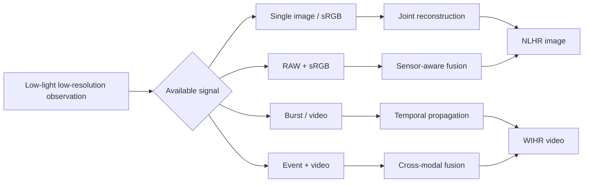

# Awesome Super-Resolution in the Dark

### A research map for low-light image and video super-resolution

*From dim, low-resolution observations to faithful, well-illuminated detail.*

> **Why this list exists.** Low-light super-resolution is not simply “enhancement + upsampling.” Darkness, sensor noise, blur, color distortion, and missing spatial detail are coupled at capture time. This repository maps the papers, code, and datasets that model that coupling explicitly.

[Explore the field](#research-map) · [Browse papers](#papers-by-setting) · [Find data](#datasets-and-benchmarks) · [Suggest an entry](CONTRIBUTING.md) · [See maintenance policy](MAINTENANCE.md)

## At a glance

| Start here | What you will find |
|---|---|
| **New to the field** | Read [RELLISUR](#datasets-and-benchmarks), then **RELIEF**, **BrZoNet**, and **TriCo** for the single-image problem formulation. |
| **Building a method** | Compare model families in the [research map](#research-map), then use the tables to locate official code and training data. |
| **Working with RAW, events, burst, or video** | Jump directly to the modality-specific tracks; these settings should not be compared as if they had identical input information. |
| **Maintaining the list** | Follow the [evidence hierarchy](MAINTENANCE.md) and submit only verifiable metadata. |

## Scope and editorial policy

**Core scope:** methods that reconstruct a well-illuminated, high-resolution image or video from low-light low-resolution observations (LLLR → NLHR/WIHR). This includes real/synthetic single-image, RAW/sRGB, burst, event, and video settings.

**Intentionally separated:** low-light face SR and domain-specific imaging are valuable but use different priors and data protocols, so they appear in their own track. Generic LLIE, ordinary SR, and simple cascades are not listed as core methods unless they establish a benchmark or directly inform the joint task.

**Resource labels:** **Code** = author-maintained runnable release; **Repository** = author repository exists but is incomplete/minimal; **Announced** = relevant implementation is promised; **—** = no author-maintained release located at curation time.

## Research map

| Family | Representative ideas | Representative papers |
|---|---|---|
| **Joint direct reconstruction** | Learn one LLLR → NLHR mapping; avoid cascade error accumulation | LSR, RELIEF, JLSN |
| **Illumination / reflectance decoupling** | Treat luminance and detail as related but distinct signals | BrZoNet, UltraIS, LoLiSRFlow |
| **Prior-guided reconstruction** | Introduce semantic, codebook, frequency, or degradation priors | TriCo, MSIRNet, DTP, DARE |
| **Sensor-aware fusion** | Preserve RAW radiance information while using sRGB/ISP cues | JSLNet, SRRIIE |
| **Temporal and event-assisted recovery** | Use complementary frames or high-contrast event streams | DFEVSR, VSRELL, RetinexEVSR |
| **Face-specific restoration** | Preserve identity, structure, and texture under coupled face degradation | IC-FSRDENet, DiffLLFace |

## Papers by setting

### 1. Single-image, natural-scene LLSR

| Year | Method | Paper | Venue | Key contribution | Resources |
|---:|---|---|---|---|---|
| 2026 | DTP | [Dual-Path Learning based on Frequency Structural Decoupling and Regional-Aware Fusion for Low-Light Image Super-Resolution](https://arxiv.org/abs/2603.27301) | ICME 2026 | Frequency decoupling with dedicated luminance and texture paths | [Code](https://github.com/JXVision/DTP) |
| 2026 | GTFMN | [Guided Texture and Feature Modulation Network for Low-Light Image Enhancement and Super-Resolution](https://arxiv.org/abs/2601.19157) | arXiv 2026 | Illumination-guided modulation of texture reconstruction | — |
| 2025 | DARE | [Degradation-Aware One-Step Diffusion Model for Content-Sensitive Super-Resolution in the Dark](https://doi.org/10.1145/3746027.3755853) | ACM MM 2025 | One-step diffusion with degradation-aware LoRA and content priors | [Code](https://github.com/csmty/DARE) |
| 2025 | UltraIS | [A Dual-Stream-Modulated Learning Framework for Illuminating and Super-Resolving Ultra-Dark Images](https://doi.org/10.1109/TNNLS.2024.3409056) | IEEE TNNLS 2025 | Illumination-semantic dual modulation and resolution-sensitive merging | [Code](https://github.com/moriyaya/UltraIS) |
| 2024 | LoLiSRFlow | [Joint Single Image Low-light Enhancement and Super-resolution via Cross-scale Transformer-based Conditional Flow](https://arxiv.org/abs/2402.18871) | arXiv 2024 | Conditional-flow modeling of one-to-many LLLR restoration | [Repository](https://github.com/Yueziyu/LoLiSRFlow) |
| 2024 | JSLNet | [Joint Image Super-resolution and Low-light Enhancement in the Dark](https://openaccess.thecvf.com/content/ACCV2024/html/Zhou_Joint_Image_Super-resolution_and_Low-light_Enhancement_in_the_Dark_ACCV_2024_paper.html) | ACCV 2024 | RAW/sRGB dual input and cross-frequency fusion | [Code & data](https://github.com/flyhu2/DarkSR) |
| 2024 | TriCo | [Enhancing Images with Coupled Low-Resolution and Ultra-Dark Degradations: A Tri-level Learning Framework](https://doi.org/10.1145/3664647.3681682) | ACM MM 2024 | Tri-level cooperative optimization, PGR training, and IHEM | [Code](https://github.com/moriyaya/TriCo) |
| 2024 | MSIRNet | [Learning Multi-Granularity Semantic Interactive Representation for Joint Low-Light Image Enhancement and Super-Resolution](https://doi.org/10.1016/j.inffus.2024.102467) | Information Fusion 2024 | Semantic and codebook priors for high-fidelity reconstruction | [Code](https://github.com/liushh39/MSIRNet) |
| 2024 | CollaBA | [Collaborative Brightening and Amplification of Low-Light Imagery via Bi-Level Adversarial Learning](https://www.sciencedirect.com/science/article/pii/S0031320324003091) | Pattern Recognition 2024 | Dual-path modulation with bi-level adversarial learning | [Code](https://github.com/moriyaya/CollaBA) |
| 2024 | BrZoNet | [Unveiling Details in the Dark: Simultaneous Brightening and Zooming for Low-Light Image Enhancement](https://doi.org/10.1609/aaai.v38i7.28515) | AAAI 2024 | Retinex-induced Siamese decoupling and illumination-aware interaction | [Code](https://github.com/Yueziyu/BrZoNet) |
| 2024 | SRRIIE | [Super-Resolving Real-world Image Illumination Enhancement: A New Dataset and a Conditional Diffusion Model](https://arxiv.org/abs/2410.12961) | arXiv 2024 | Real RAW benchmark and conditionally guided diffusion | [Code & data](https://github.com/Yaofang-Liu/Super-Resolving) |
| 2023 | JLSN | [Joint Low-light Enhancement and Super Resolution with Image Underexposure Level Guidance](https://papers.bmvc2023.org/0046.pdf) | BMVC 2023 | Underexposure estimation and multi-scale sampling for generalization | — |
| 2023 | RELIEF | [Joint Low-Light Image Enhancement and Super-Resolution with Transformers](https://vbn.aau.dk/files/751780650/relief_scia2023_camera_ready.pdf) | SCIA 2023 | Hierarchical Transformer with efficient cross-shaped attention | — |
| 2022 | LSR | [LSR: Lightening Super-Resolution Deep Network for Low-Light Image Enhancement](https://doi.org/10.1016/j.neucom.2022.08.025) | Neurocomputing 2022 | Iterative back-projection for lightening and SR | — |

### 2. Burst, video, and event-assisted LLSR

| Year | Method | Paper | Venue | Input / output | Resources |
|---:|---|---|---|---|---|
| 2026 | RetinexEVSR | [Seeing the Unseen: Zooming in the Dark with Event Cameras](https://doi.org/10.1609/aaai.v40i7.37478) | AAAI 2026 | Low-light RGB video + events → HR video | [Code](https://github.com/DachunKai/RetinexEVSR) |
| 2026 | VSRELL | [VSRELL: A Simple Baseline for Video Super-Resolution and Enhancement in Low-Light Environment](https://openaccess.thecvf.com/content/CVPR2026/html/Hui_VSRELL_A_Simple_Baseline_for_Video_Super-Resolution_and_Enhancement_in_CVPR_2026_paper.html) | CVPR 2026 | LLLR video → well-illuminated HR video | [Announced](https://github.com/373hdj/VSRELL) |
| 2025 | BIRE / BIPNet | [Burst Image Restoration and Enhancement](https://doi.org/10.1109/TPAMI.2024.3356188) | IEEE TPAMI 2025 | Includes low-light burst SR protocol on SID-SR | [Code](https://github.com/akshaydudhane16/BIPNet) |
| 2023 | DFEVSR | [Dual Feature Enhanced Video Super-Resolution Network Based on Low-Light Scenarios](https://doi.org/10.1016/j.image.2023.116984) | Signal Processing: Image Communication 2023 | Low-light industrial video → HR video | — |

### 3. Low-light face super-resolution

| Year | Method | Paper | Venue | Key contribution | Resources |
|---:|---|---|---|---|---|
| 2026 | DiffLLFace | [Learning Alternate Illumination-Diffusion Adaptation for Low-Light Face Super-Resolution and Beyond](https://doi.org/10.1109/TIP.2026.3671638) | IEEE TIP 2026 | Alternate illumination-diffusion adaptation with Fourier enhancement | [Code](https://github.com/KaishengPang/DiffLLFace) |
| 2024 | IC-FSRDENet | [Low-Light Face Super-resolution via Illumination, Structure, and Texture Associated Representation](https://doi.org/10.1609/aaai.v38i6.28339) | AAAI 2024 | Mutual illumination/structure learning and diffusion detail enhancement | [Code](https://github.com/wcy-cs/IC-FSRDENet) |
| 2024 | Bi-factor DD | [Watch You Under Low-Resolution and Low-Illumination: Face Enhancement via Bi-Factor Degradation Decoupling](https://doi.org/10.1109/TCSVT.2023.3325357) | IEEE TCSVT 2024 | Separates illumination and resolution degradation factors | — |
| 2024 | LFRNet | [Low-Light Face Super-Resolution With Light Frequency Representation](https://doi.org/10.1109/AIPMV62663.2024.10692293) | AIPMV 2024 | Light-frequency representation for face detail recovery | — |

### 4. Specialized and adjacent work

| Year | Paper | Venue | Why it is separate | Resources |
|---:|---|---|---|---|
| 2022 | [JSENet: A Deep Convolutional Neural Network for Joint Image Super-Resolution and Enhancement](https://doi.org/10.1016/j.neucom.2021.12.071) | Neurocomputing 2022 | General color/contrast enhancement plus SR; not exclusively low-light | — |
| 2021 | [Low-Light-Level Image Super-Resolution Reconstruction Based on a Multi-Scale Features Extraction Network](https://doi.org/10.3390/photonics8080321) | Photonics 2021 | Low-light-level detector and grayscale/colorization setting | — |

## Datasets and benchmarks

| Dataset | Year | Modality | Ground truth / protocol | Best starting point |
|---|---:|---|---|---|
| **RELLISUR** | 2021 | Real-captured sRGB | LLLR images paired with normal-light HR; multiple resolutions and darkness levels | [Paper](https://neurips.cc/virtual/2021/29875) · [Homepage](https://vap.aau.dk/rellisur/) · [Download](https://doi.org/10.5281/zenodo.5234969) |
| **LOL-SR** | 2022 | Synthetic sRGB | LOL images downsampled for joint LLSR | Introduced with [LSR](https://doi.org/10.1016/j.neucom.2022.08.025) |
| **DFSR-LLE** | 2024 | Synthetic sRGB | 7,100 LLLR/NLHR pairs modeling coupled degradation | [LoLiSRFlow](https://arxiv.org/abs/2402.18871) |
| **DarkSR** | 2024 | RAW + sRGB | LR low-light RAW/sRGB with normal-light HR sRGB | [Paper](https://openaccess.thecvf.com/content/ACCV2024/html/Zhou_Joint_Image_Super-resolution_and_Low-light_Enhancement_in_the_Dark_ACCV_2024_paper.html) · [Code & data](https://github.com/flyhu2/DarkSR) |
| **SRRIIE** | 2024 | Real RAW | 4,800 paired images across −6 to 0 EV and ISO 50–12,800 | [Paper](https://arxiv.org/abs/2410.12961) · [Repository](https://github.com/Yaofang-Liu/Super-Resolving) |
| **SID-SR** | 2025 | RAW burst | Burst ×4 low-light SR protocol derived from SID | Described in [BIRE](https://doi.org/10.1109/TPAMI.2024.3356188) |
| **SDSD / SDE / RELED** | 2026 | RGB + events | Low-light video/event protocols used by RetinexEVSR | [RetinexEVSR resources](https://github.com/DachunKai/RetinexEVSR) |

### Evaluation notes

- Report whether degradation is **real-captured** or **synthetically composed**; these settings should not be mixed without explanation.
- State the scale factor, color space (RAW/sRGB), darkness/exposure protocol, crop/alignment policy, and test split.
- Report fidelity and perceptual metrics together where possible. PSNR/SSIM alone do not fully describe illumination naturalness or hallucinated texture.
- Reproducibility depends on external checkpoints, exact ISP/preprocessing, and data licenses; a public repository does not automatically imply a fully reproducible release.

## Reviews and companion collections

- [Low-Light Image Super-Resolution Using GANs: A Comprehensive Comparative Review](https://doi.org/10.52783/jisem.v10i49s.10024) — focused review (2025).
- [Awesome Super-Resolution](https://github.com/ChaofWang/Awesome-Super-Resolution) — broader SR literature.
- [Awesome Low-Light Image Enhancement](https://github.com/zhihongz/awesome-low-light-image-enhancement) — LLIE methods, datasets, and metrics.
- [Awesome Burst Image Restoration](https://github.com/qulishen/Awesome-Burst-Image-Restoration) — multi-frame restoration.
- [Awesome Diffusion Models in Low-Level Vision](https://github.com/ChunmingHe/awesome-diffusion-models-in-low-level-vision) — diffusion-based restoration.

## Contribute and maintain

This is a deliberately maintained list—not a claims leaderboard. Please read [CONTRIBUTING.md](CONTRIBUTING.md) before proposing an entry. The repository uses an [evidence-based maintenance protocol](MAINTENANCE.md), a weekly external-link check, and a public [changelog](CHANGELOG.md).

If this map is useful, a star and a carefully sourced correction are both meaningful contributions.

## License

The bibliography and original repository text are released under [CC0 1.0](LICENSE). Linked papers, code, datasets, and images retain their own licenses and copyrights.
